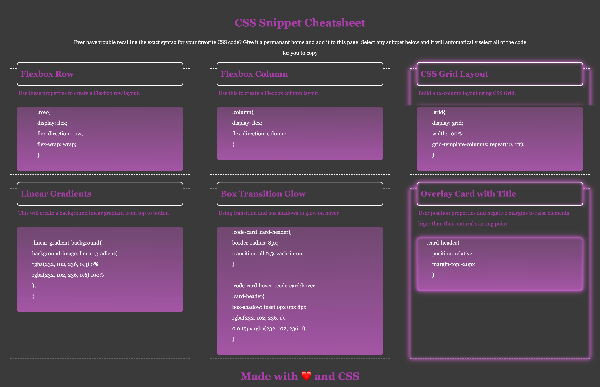

<h1># Module 02 Mini-Project: CSS Snippet Cheat Sheet<h1>

In this activity, we had to build a webpage that holds a collection of CSS snippets.

<h2>## Specifications<h2>
<ol>
<li>Added the CSS snippets in a responsive grid, hove over the grids to see that the grid glows</li>
<li>Added a proper heading to it</li>
<li>The webpage is created to support devices as well</li>
<li>Used semantic HTML elements and in proper indentation</li>
<li>Made use of Var tags, flex properties to created this layout</li>
<li>Added a favicon to the webpage</li>
</ol>

<h2>## Website Link<h2>
<a href="https://rimadas9878.github.io/Week2-Mini-Project/" target="_blank">Click here to view the website</a>

URL: https://rimadas9878.github.io/Week2-Mini-Project/

<h2>## Website Image<h2>
